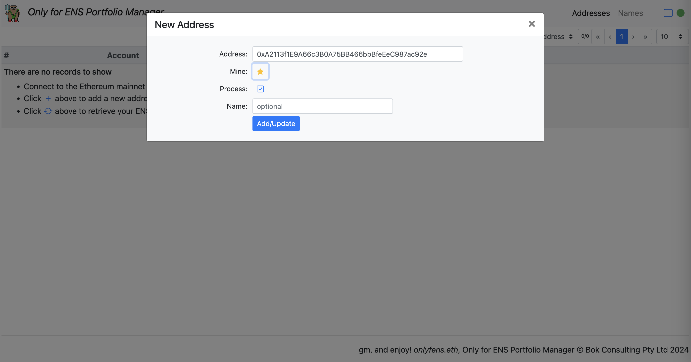
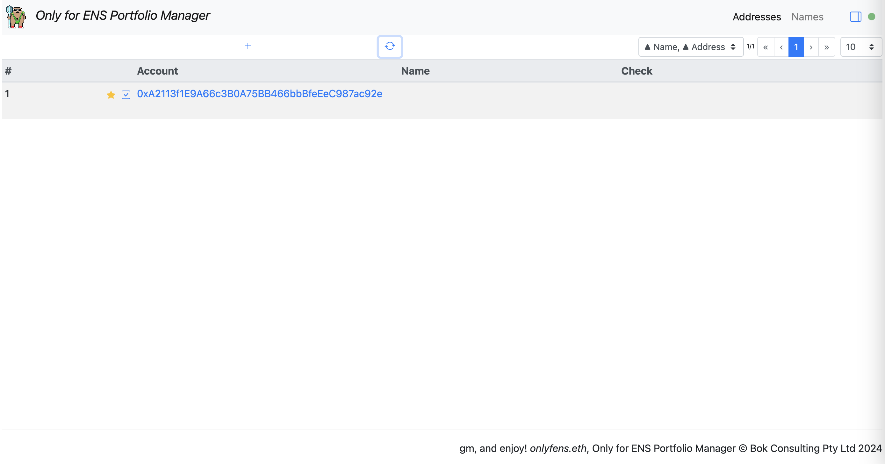
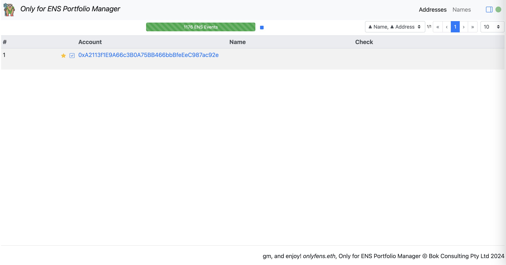

# Portfolio Manager - only for ENS (WIP)

https://bokkypoobah.github.io/onlyfens/

 

## Algorithm

* Enter one or more of your Ethereum addresses
* Scrape all ERC-721 and ERC-1155 transfer events to and from your list of addresses
* Scrape all ERC-721 ENS `NameRegistered` and `NameRenewed` events for all the tokenIds of your transferred ERC-721 events
* Scrape all ERC-1155 ENS `NameWrapped` events for all the tokenIds of your transferred ERC-1155 events
* Scrape the block timestamps for each event above
* Merge all the data together

 

## Screenshots

### Addresses - Empty

<kbd></kbd>

Click on the [+] button to add a new address.

### Add New Address

<kbd></kbd>

Add the new address.

### Addresses - Single Address

<kbd></kbd>

Click on the [sync] button.

### Sync Options

<kbd></kbd>

Click on the [Do It] button.

### Sync Progress

<kbd></kbd>

This will take a few minutes.

### ENS Names

<kbd></kbd>

 

 

Enjoy!

© Bok Consulting Pty Ltd 2024, MIT license
