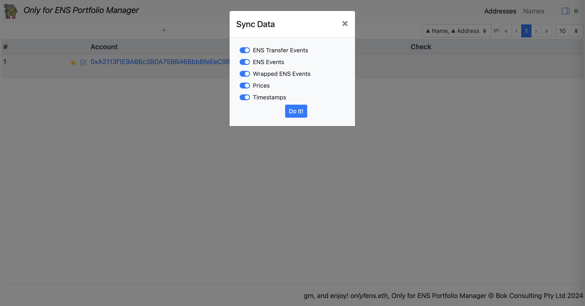

# The Manager

ENS Portfolio Manager (WIP)

https://bokkypoobah.github.io/TheManager/

 

## Screenshots

### Addresses - Empty

<kbd></kbd>

Click on the [+] button to add a new address.

### Add New Address

<kbd></kbd>

Add the new address.

### Addresses - Single Address

<kbd></kbd>

Click on the [sync] button.

### Sync Options

<kbd></kbd>

Click on the [Do It] button.

### Sync Progress

<kbd></kbd>

This will take a few minutes.

### ENS Names

<kbd></kbd>

 

 

Enjoy!

© Bok Consulting Pty Ltd 2024, MIT license
