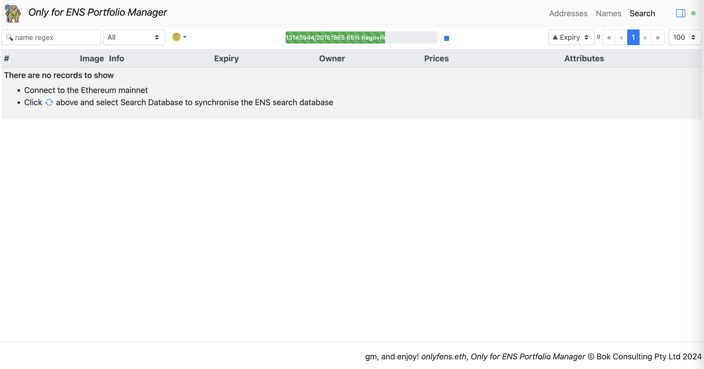
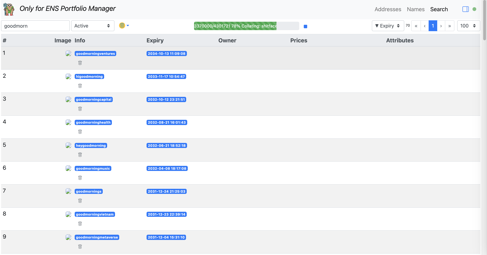
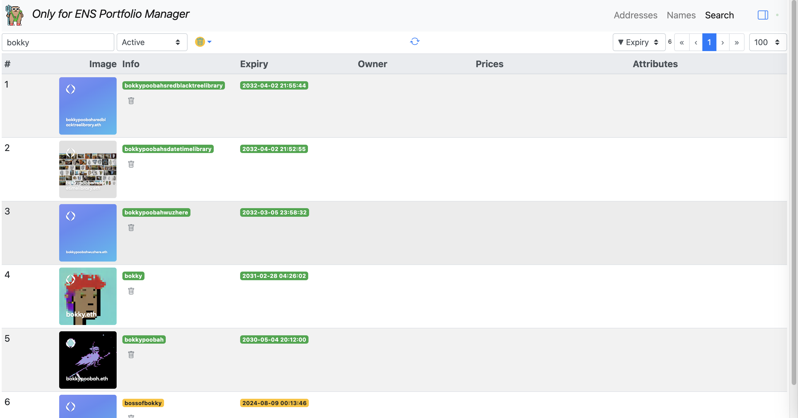

# Only for ENS

https://bokkypoobah.github.io/onlyfens/

**WIP** - If this dapp is not working as expected, please clear your LocalStorage and IndexedDB entries for this dapp and try again.

Jun 25 2024 - Infura seems to have changed their event log scraping server's responses so that errors are returned when there are more than a few hundred events in the `getLog()` calls. This limit used to be 10k.

 

## Algorithm - Addresses and Names

* Enter one or more of your Ethereum addresses
* Scrape all ERC-721 and ERC-1155 transfer events to and from your list of addresses
* Scrape all ERC-721 ENS `NameRegistered` and `NameRenewed` events for all the tokenIds of your transferred ERC-721 events
* Scrape all ERC-1155 ENS `NameWrapped` events for all the tokenIds of your transferred ERC-1155 events
* Scrape last, listing and best offer prices from the Reservoir API for each of the ERC-721 and ERC-1155 ENS tokenIds
* Scrape the block timestamps for each event above
* Merge all the data together

 

## Algorithm - Search (WIP)

* Retrieve all ERC-721 ENS `NameRegistered` and `NameRenewed` and ERC-1155 ENS `NameWrapped` events
  * Retrieving 4.3 million events takes ~ 40 minutes @ Jun 23 2024
  * Collating 4.3 million events takes ~ 4 minutes @ Jun 23 2024
* Use information above for initial search query results
* Retrieve transfers and prices for search query results when requested

 

## Screenshots

### Addresses - Empty

<kbd></kbd>

Click on the [+] button to add a new address.

### Add New Address

<kbd></kbd>

Add the new address.

### Addresses - Single Address

<kbd></kbd>

Click on the [sync] button.

### Sync Options

<kbd></kbd>

Click on the [Do It] button.

### Sync Progress

<kbd></kbd>

This will take a few minutes.

### ENS Names

<kbd></kbd>

### Search - Registration And Renewal Event Retrieval

Note: Retrieving 4.3 million events takes ~ 40 minutes @ Jun 23 2024

<kbd></kbd>

### Search - Collation In Progress

Note: Collating 4.3 million events takes ~ 4 minutes @ Jun 23 2024

<kbd></kbd>

### Search

<kbd></kbd>

 

### Search - With Details

Click on the [Cloud-Download] icon to retrieve ownership, metadata and price details from the Reservoir API

<kbd></kbd>

 

 

Enjoy!

© Bok Consulting Pty Ltd 2024, MIT license
